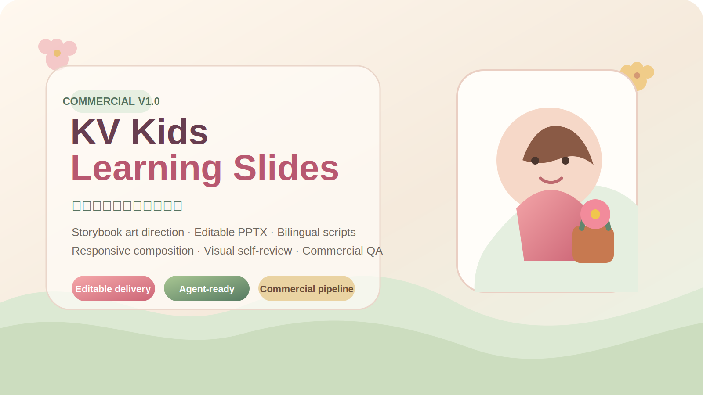
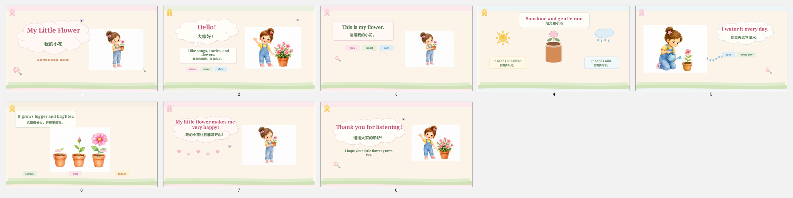

<div align="center">
  
</div>

<div align="center">
  <strong>把儿童 PPT 从“自动生成文件”，升级为“完整的视觉作品生产系统”。</strong>
</div>

<div align="center">
  <br />
  
  
  
  
</div>

# KV Kids Learning Slides

`kv-kids-learning-slides` 是一套面向幼儿园与小学场景的儿童 PPT / PPTX 生成 Skill。它不只负责“把文字放进幻灯片”，而是协调内容策划、绘本艺术指导、角色连续性、响应式排版、可编辑组件、双语讲稿和多层质量审查，最终交付可以继续修改、排练和正式放映的完整文件。

> 当前仓库按商业化预研项目管理。源代码、视觉资产和许可策略在正式公开前仍需进行商业边界审查。

## 它解决什么问题

普通 AI PPT 往往会出现：模板感明显、页面空洞、字体违和、角色不一致、图文关系弱、演讲稿和屏幕内容混在一起，以及“文件能打开但不值得付费”的问题。

本项目把生产过程拆成可验证的专业流程：

1. 识别课堂课件或儿童舞台演讲场景；
2. 确定年龄、难度、目标词数、双语模式和交付等级；
3. 建立内容结构、绘本艺术方向和角色身份锁；
4. 为关键页面生成多套构图候选；
5. 混合使用 AI 主插画、PowerPoint 原生图形和代码视觉组件；
6. 输出正式版、排练版、Markdown / Word 讲稿；
7. 执行几何审查、视觉截图审查和商业审美评分。

## 核心能力

### 儿童演讲与课堂双路线

- 幼儿园或小学生双语演讲、自我介绍、故事分享；
- 儿童课堂课件、家庭辅导与练习型内容；
- 正式放映版、家庭排练版、教师备注和答案版本分离。

### 商业级视觉生产线

- 艺术总监层：核心情绪、视觉隐喻、色彩叙事和页面节奏；
- 响应式绘本布局：根据内容量自动选择构图，不死套左右分栏；
- 角色表演资产：问候、观察、浇水、等待、惊喜、鼓掌和告别；
- 字体锁版：中英文层级、字宽测量、光学居中和重点词渲染；
- 代码组件：气泡、花瓣标签、纸片边框、叶片、天气图标和轻动效；
- 多候选构图与商业审美评分。

### 可编辑交付

默认保留原生 PowerPoint 对象：

- 标题、正文、标签和页码；
- 圆角容器、气泡、丝带、流程和天气组件；
- 可调整色彩、尺寸和位置的结构元素；
- 复杂角色和绘本场景可作为高质量艺术资产嵌入。

### 自审与质量门

- 文字与边框、分隔线和容器的几何冲突；
- 字号、中文层级、角色连续性和页面重复度；
- 图片重复、包体预算、本地路径泄露和对象命名；
- 自动渲染逐页 PNG 与缩略图总览；
- Agent 必须视觉复核后才能完成商业级交付。

## 默认交付文件

儿童演讲路线默认输出：

```text
stage_deck.pptx
speaker_script.md
speaker_script.docx
qa_report.json
```

需要排练时增加：

```text
rehearsal_deck.pptx
```

课堂课件路线默认输出：

```text
editable_deck.pptx
teacher_notes.md
qa_report.json
```

## 商业精品样例

<div align="center">
  
</div>

样例位于 [`examples/my-little-flower/`](examples/my-little-flower/)，包含 PPTX、缩略图、艺术方向、多候选构图和商业质量报告。

## 三档生产模式

| 模式 | 适合场景 | 主要特征 |
|---|---|---|
| 快速草稿 | 临时教学、家庭辅导 | 原生图形为主，一轮工程检查 |
| 标准成品 | 日常演讲、课堂展示 | 统一插画、三种以上构图、视觉复核 |
| 商业精品 | 比赛、公开展示、付费交付 | 艺术方向、多候选构图、角色资产包、两轮精修、商业评分 |

## 仓库结构

```text
kv-kids-learning-slides/
├── SKILL.md
├── agents/
├── assets/
├── references/
├── scripts/
├── docs/                  # 专属项目主页
├── examples/              # 商业精品样例
└── README.md
```

## 当前状态

- 版本：`1.0`
- 阶段：商业化预研 / 私有仓库
- 基准风格：水彩绘本风 + 原生气泡组件 + 稳定儿童角色
- 重点方向：提高艺术资产质量、扩展回归样例、完善授权和定价策略

## 商业化注意事项

在公开仓库或对外分发 Skill 源代码前，请先阅读 [`COMMERCIALIZATION.md`](COMMERCIALIZATION.md)。当前包内保留历史 MIT 许可文件；如果目标是保留独占商业权利，需要在公开发布前重新确认许可策略，不能直接沿用默认开源授权。

## 文档主页

静态主页源文件位于 [`docs/index.html`](docs/index.html)。仓库创建后可将 `docs/` 配置为 GitHub Pages 来源，作为对外产品介绍页。
